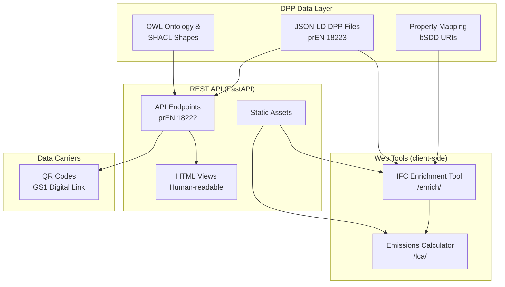

# buildingSMART DPP Demo

**A demonstration implementation of Digital Product Passports for construction products.**

Proof-of-concept conforming to draft European standards prEN 18216--18223 and ISO 22057:2022, developed in the context of the [DPP Keystone](https://dpp-keystone.org/) initiative. All product properties are linked to the [buildingSMART Data Dictionary (bSDD)](https://www.buildingsmart.org/users/services/buildingsmart-data-dictionary/) and identified using [GS1](https://www.gs1.org/standards/gs1-digital-link) identifiers.

> **Disclaimer:** This is a demonstration project. All product data is illustrative. The prEN standards are drafts under CEN enquiry and may change before final publication. This implementation is not affiliated with or endorsed by CEN, ISO, or the European Commission.

**Live demo:** [bsdd-dpp.dev](https://bsdd-dpp.dev)

---

## Live Demo

Hosted at [bsdd-dpp.dev](https://bsdd-dpp.dev). All processing runs entirely client-side; no data is uploaded to a server.

### IFC Enrichment Tool

Four-step workflow for enriching IFC building models with DPP data:

1. **Upload** -- Select an IFC file
2. **Review** -- Inspect element-to-product assignments
3. **Process** -- In-browser enrichment with real-time progress
4. **Export** -- Download the enriched IFC file

Writes into the IFC model: property sets, bSDD classification references, EPD indicators (EN 15804+A2), document references (DoP, EPD), GS1 identifiers (GTIN, Digital Links), and DPP resolver links (DID:web).

### Emissions Calculator

Three-step whole-building LCA tool:

1. **Upload** -- Load an IFC file (optionally enriched from the previous tool)
2. **Configure** -- Select EN 15804+A2 life cycle modules (A1--A3, A4, A5, C2--C4)
3. **Results** -- Environmental impact results with material and module breakdowns (export to CSV/JSON)

---

## Standards Conformance

| Standard | Scope |
|----------|-------|
| prEN 18223:2025 | System interoperability and data model |
| prEN 18222:2025 | API specification |
| prEN 18221:2025 | Storage, archiving, and persistence |
| prEN 18220:2025 | Data carriers (QR codes) |
| prEN 18219:2025 | Unique identifiers (DIDs, GS1) |
| prEN 18216:2025 | Data exchange protocols (JSON-LD, HTTPS) |
| ISO 22057:2022 | Data templates for EPD in BIM |
| EN 15804+A2 | Environmental product declarations (LCA indicators) |

---

## Architecture



---

## Getting Started

Prerequisites: Python 3.10+, Node.js 18+ (for building web tools from source).

```bash
# Install and start the API server
cd api && pip install -r requirements.txt && python main.py
```

The server starts at `http://localhost:8000` with API docs at `/docs`, IFC enrichment at `/enrich/`, and emissions calculator at `/emissions/`.

To build web tools from source: `cd web && npm install && npm run build` (output goes to `api/static/`).

---

## Sample DPPs

| Product | Type | Key Properties | GTIN |
|---------|------|----------------|------|
| Knauf Acoustic Batt | Mineral wool insulation | Thermal conductivity, fire reaction, sound absorption | 04012345678901 |
| Schilliger Glulam GL24h | Engineered timber | Bending strength, density, formaldehyde emission | 07611234567890 |
| PVC Sewage Pipe | Infrastructure pipe | Ring stiffness, impact resistance, chemical resistance | 04098765432109 |

Each DPP includes bSDD-linked properties, EPD data per ISO 22057, Declaration of Performance data, and linked documents with SHA-256 hash verification.

---

## REST API

Conforms to prEN 18222:2025. Supports content negotiation (JSON-LD or HTML).

| Method | Endpoint | Description |
|--------|----------|-------------|
| `POST` | `/dpps` | Create a new DPP |
| `GET` | `/dpps/{dppId}` | Retrieve a DPP |
| `PATCH` | `/dpps/{dppId}` | Update (JSON Merge Patch) |
| `DELETE` | `/dpps/{dppId}` | Delete a DPP |
| `GET` | `/dppsByProductId/{productId}` | Look up by product identifier |
| `POST` | `/registerDPP` | Register with EU registry (simulated) |

Identifier resolution:
- DID:web: `GET /dpps/did:web:bsdd-dpp.dev:dpp:{product-id}`
- GS1 Digital Link: `GET /id/01/{GTIN}/21/{SERIAL}`

---

## Data Model

Each DPP document (prEN 18223) contains:

- **Header** -- DPP ID (DID:web), status, schema version, timestamps
- **Economic operator** -- Organisation with LEI and GLN identifiers
- **Product identifiers** -- GTIN (GS1), manufacturer part number
- **Data collections** -- Product properties (bSDD), EPD data (ISO 22057 / EN 15804+A2), DoPC, linked documents, data carriers
- **Change log** -- Audit trail with actor, timestamp, and change type

### Identifier schemes

DID:web (DPP documents), GS1 GTIN (products), LEI (organisations), GLN (facilities).

### EPD indicators (EN 15804+A2)

LCIA: GWP (total, fossil, biogenic, luluc), ODP, AP, EP (freshwater, marine, terrestrial), POCP, ADPE, ADPF. Life cycle stages A1--A3, A4, A5, B1--B7, C1--C4, D.

---

## Semantic Interoperability

All properties link to:

- **bSDD** -- Property and classification URIs for all product properties
- **GS1** -- Product and organisation identifiers (GTIN, GLN, Digital Link)
- **IFC** -- IfcExternalReference for bSDD URIs; IfcDocumentReference for EPD/DoP/DPP documents

Property-to-IFC mapping is defined in `mapping/mapping.csv`.

---

## Ontology and Validation

**OWL 2 ontology** (`ontology/dpp-ontology.jsonld`) under namespace `https://w3id.org/dpp#`: 21 classes, 16 object properties, 30 datatype properties, with equivalence mappings to schema.org. Served at `GET /ontology`.

**SHACL shapes** (`ontology/dpp-shacl.jsonld`): 9 validation shapes conforming to prEN 18216--18223 (DigitalProductPassport, Organisation, ProductIdentifier, DataElementCollection, DataElement, ValueElement, ChangeEvent, DeclarationOfPerformance, Document). Served at `GET /ontology/shacl`.

---

## Declaration of Performance (DoPC)

Each DPP includes DoPC data with declaration code, harmonised standard, AVCP system, and notified body.

| Product | Harmonised Standard | Key Declared Properties |
|---------|---------------------|------------------------|
| Knauf Acoustic Batt | EN 13162:2012+A1:2015 | Thermal conductivity, fire reaction, sound absorption |
| Schilliger Glulam | EN 14080:2013 | Strength class (GL24h), bending strength, density |
| PVC Sewage Pipe | EN 1401-1:2019 | Ring stiffness, impact resistance, chemical resistance |

All DoPC properties are linked to bSDD URIs with provenance metadata referencing the source DoP document.

---

## References and Standards

### European standards (draft)

- prEN 18216--18223:2025 -- Digital Product Passport for construction products (data exchange, identifiers, data carriers, storage, API, data model)

### International standards

- [ISO 22057:2022](https://www.iso.org/standard/72463.html) -- Data templates for EPDs in BIM
- [EN 15804+A2](https://www.en-standard.eu/) -- Environmental product declarations
- [ISO 23386](https://www.iso.org/standard/75401.html) / [ISO 23387](https://www.iso.org/standard/75403.html) -- Interconnected data dictionaries

### External resources

- [DPP Keystone](https://dpp-keystone.org/) -- Reference framework for Digital Product Passports in construction
- [buildingSMART Data Dictionary (bSDD)](https://www.buildingsmart.org/users/services/buildingsmart-data-dictionary/) -- Classification and property definitions
- [GS1 Digital Link](https://www.gs1.org/standards/gs1-digital-link) -- Identifier resolution standard
- [ESPR](https://commission.europa.eu/energy-climate-change-environment/standards-tools-and-labels/products-labelling-rules-and-requirements/sustainable-products/ecodesign-sustainable-products-regulation_en) -- EU Ecodesign for Sustainable Products Regulation

---

**Disclaimer:** This is a demonstration. All product data is illustrative and does not represent real manufacturer declarations. The prEN 18216--18223 standards are drafts under CEN enquiry and subject to change.
