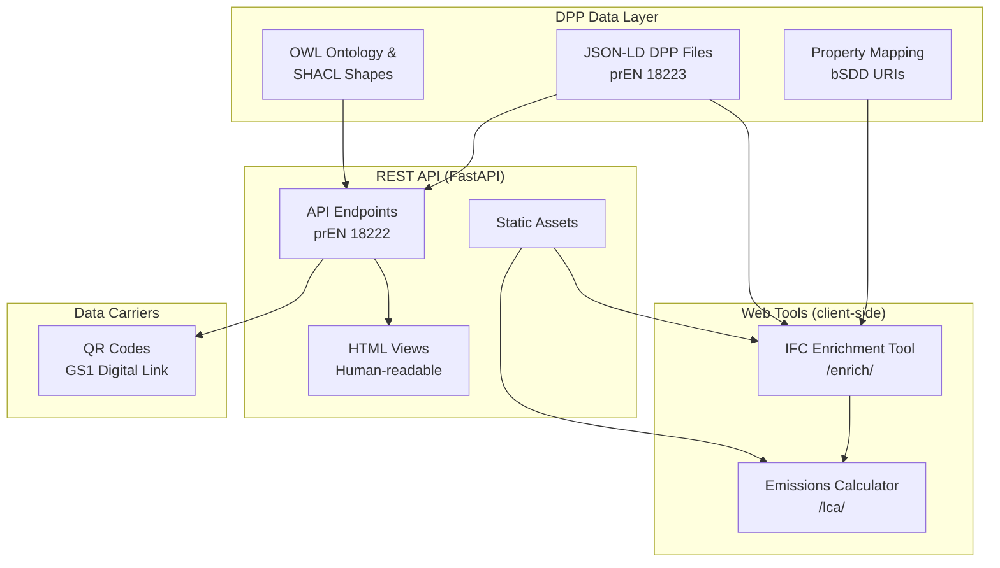

# buildingSMART DPP Demo

**A demonstration implementation of Digital Product Passports for construction products.**

This repository contains a proof-of-concept implementation of Digital Product Passports (DPP) for construction products, conforming to the draft European standards prEN 18216--18223 and ISO 22057:2022 for machine-readable EPD data. It is developed in the context of the [DPP Keystone](https://dpp-keystone.org/) initiative.

> **Disclaimer:** This is a demonstration project. All product data is illustrative. The prEN standards referenced are drafts under CEN enquiry and may change before final publication. This implementation is not affiliated with or endorsed by CEN, ISO, or the European Commission.

**Live demo:** [bsdd-dpp.dev](https://bsdd-dpp.dev)

---

## Table of Contents

- [Overview](#overview)
- [Live Demo](#live-demo)
- [Standards Conformance](#standards-conformance)
- [Architecture](#architecture)
- [Project Structure](#project-structure)
- [Getting Started](#getting-started)
- [Sample DPPs](#sample-dpps)
- [Web Tools](#web-tools)
- [REST API](#rest-api)
- [Data Model](#data-model)
- [Semantic Interoperability](#semantic-interoperability)
- [Ontology and Validation](#ontology-and-validation)
- [Declaration of Performance (DoPC)](#declaration-of-performance-dopc)
- [References and Standards](#references-and-standards)

---

## Overview

The buildingSMART DPP Demo implements the full lifecycle of a Digital Product Passport as specified by the upcoming European standards for construction products. It demonstrates how DPP data can be created, queried, enriched into IFC building models, and used for whole-building life cycle assessment (LCA).

The demo includes:

- Three fully specified DPP documents (JSON-LD) with product properties, EPD data, and Declarations of Performance
- A REST API conforming to prEN 18222:2025
- A browser-based IFC enrichment tool that writes DPP data into IFC models
- A browser-based emissions calculator for whole-building LCA per EN 15804+A2
- QR code data carriers with GS1 Digital Link resolution
- An OWL ontology and SHACL shapes for validation

All product properties are linked to the buildingSMART Data Dictionary (bSDD) and identified using GS1 identifiers (GTIN, GLN).

---

## Live Demo

The web demo is hosted at [bsdd-dpp.dev](https://bsdd-dpp.dev) and consists of two browser-based tools. All processing runs entirely client-side; no data is uploaded to a server.

### IFC Enrichment Tool

A four-step workflow for enriching IFC building models with DPP data:

1. **Upload** -- Select an IFC file (drag-and-drop or file browser)
2. **Review** -- Inspect element-to-product assignments before enrichment
3. **Process** -- Enrichment runs in-browser with real-time progress
4. **Export** -- Download the enriched IFC file

The enrichment writes the following into the IFC model:

- Property sets (thermal conductivity, density, strength classes, fire reaction, etc.)
- bSDD classification references (buildingSMART Data Dictionary URIs)
- EPD indicators per EN 15804+A2 (GWP, ODP, AP, EP, POCP, ADPE, ADPF)
- Document references (Declaration of Performance, datasheets, EPD documents)
- GS1 identifiers (GTIN, serial numbers, GS1 Digital Links)
- DPP resolver links (DID:web URIs)

### Emissions Calculator

A three-step whole-building LCA tool:

1. **Upload** -- Load an IFC file (optionally enriched from the previous tool)
2. **Configure** -- Select EN 15804+A2 life cycle modules (A1--A3, A4, A5, C2--C4)
3. **Results** -- View environmental impact results with material and module breakdowns

Results can be exported to CSV or JSON.

---

## Standards Conformance

This implementation addresses the following standards:

| Standard | Scope |
|----------|-------|
| prEN 18223:2025 | System interoperability and data model |
| prEN 18222:2025 | API specification |
| prEN 18221:2025 | Storage, archiving, and persistence |
| prEN 18220:2025 | Data carriers (QR codes) |
| prEN 18219:2025 | Unique identifiers (DIDs, GS1) |
| prEN 18216:2025 | Data exchange protocols (JSON-LD, HTTPS) |
| ISO 22057:2022 | Data templates for EPD in BIM |
| EN 15804+A2 | Environmental product declarations (LCA indicators) |

---

## Architecture



---

## Project Structure

```
openDPP/
├── api/
│   ├── main.py                      # FastAPI server
│   ├── requirements.txt             # Python dependencies
│   └── static/                      # Compiled web tools
│       ├── enrich/                   # IFC enrichment tool
│       └── emissions/               # Emissions calculator
├── data/                            # Documents served via /files (EPD, DoP, etc.)
├── docs/
│   ├── openapi.yaml                 # OpenAPI 3.0 specification
│   └── comparison-dpp-keystone.md   # Schema comparison with DPP Keystone
├── dpp/
│   └── products/                    # DPP JSON-LD documents
├── ifc/
│   ├── samples/                     # Input IFC files
│   ├── outputs/                     # Enriched IFC outputs
│   ├── ids/                         # IDS definitions
│   └── tools/                       # IFC utilities (patch_ifc.py)
├── mapping/
│   └── mapping.csv                  # Property-to-IFC mapping with bSDD URIs
├── ontology/
│   ├── dpp-ontology.jsonld          # OWL 2 ontology (JSON-LD)
│   └── dpp-shacl.jsonld             # SHACL validation shapes
├── qr_codes/                        # Generated QR images
│   └── tools/
│       └── generate_qr_codes.py     # QR code generator
├── web/                             # Web tool source (TypeScript, Vite)
│   ├── src/
│   ├── index.html                   # IFC enrichment tool entry
│   └── lca.html                     # Emissions calculator entry
├── run_demo.sh                      # One-command demo runner
└── README.md
```

---

## Getting Started

### Prerequisites

- Python 3.10+
- Node.js 18+ (for building web tools from source)

### 1. Install dependencies

```bash
cd api
pip install -r requirements.txt
```

### 2. Start the API server

```bash
cd api
python main.py
```

The server starts at `http://localhost:8000`:

- API endpoints: `http://localhost:8000/dpps/`
- Interactive API docs: `http://localhost:8000/docs`
- IFC enrichment tool: `http://localhost:8000/enrich/`
- Emissions calculator: `http://localhost:8000/emissions/`

### 3. Generate QR codes (optional)

```bash
pip install qrcode pillow
python qr_codes/tools/generate_qr_codes.py
```

### Building web tools from source

```bash
cd web
npm install
npm run build
```

The build output is placed in `api/static/`.

---

## Sample DPPs

The demo includes three fully specified Digital Product Passports:

| Product | Type | Key Properties | GTIN |
|---------|------|----------------|------|
| Knauf Acoustic Batt | Mineral wool insulation | Thermal conductivity, fire reaction, sound absorption | 04012345678901 |
| Schilliger Glulam GL24h | Engineered timber | Bending strength, density, formaldehyde emission | 07611234567890 |
| PVC Sewage Pipe | Infrastructure pipe | Ring stiffness, impact resistance, chemical resistance | 04098765432109 |

Each DPP includes product properties linked to bSDD URIs, complete EPD data per ISO 22057, Declaration of Performance data, and linked documents (DoP, datasheets, EPD reports) with SHA-256 hash verification.

---

## REST API

The API conforms to prEN 18222:2025. Core endpoints:

| Method | Endpoint | Description |
|--------|----------|-------------|
| `POST` | `/dpps` | Create a new DPP |
| `GET` | `/dpps/{dppId}` | Retrieve a DPP (JSON-LD or HTML, via content negotiation) |
| `PATCH` | `/dpps/{dppId}` | Update using JSON Merge Patch |
| `DELETE` | `/dpps/{dppId}` | Delete a DPP |
| `GET` | `/dppsByProductId/{productId}` | Look up DPP by product identifier |
| `POST` | `/registerDPP` | Register with EU registry (simulated) |
| `GET` | `/ontology` | OWL ontology (JSON-LD) |
| `GET` | `/ontology/shacl` | SHACL validation shapes (JSON-LD) |

### Identifier resolution

The API resolves both DID:web and GS1 Digital Link identifiers:

- DID:web: `GET /dpps/did:web:bsdd-dpp.dev:dpp:{product-id}`
- GS1 Digital Link: `GET /id/01/{GTIN}/21/{SERIAL}` or `GET /id/01/{GTIN}/10/{BATCH}`

### Example: retrieve a DPP as JSON-LD

```bash
curl http://localhost:8000/dpps/did:web:bsdd-dpp.dev:dpp:knauf-acoustic-batt-2025-001 \
  -H "Accept: application/ld+json"
```

---

## Data Model

### DPP structure (prEN 18223)

Each DPP document contains:

- **Header** -- DPP ID (DID:web), status, schema version, creation and modification timestamps
- **Economic operator** -- Organisation with LEI and GLN identifiers
- **Product identifiers** -- GTIN (GS1), manufacturer part number, custom IDs
- **Data collections**:
  - Product properties with bSDD references
  - EPD data (ISO 22057 / EN 15804+A2)
  - Declaration of Performance data
  - Linked documents with hash verification
  - Data carrier information (QR codes)
- **Change log** -- Full audit trail with actor, timestamp, and change type

### Identifiers (prEN 18219)

| Scheme | Usage |
|--------|-------|
| DID:web | Decentralised identifiers for DPP documents |
| GS1 GTIN | Global Trade Item Numbers for products |
| LEI | Legal Entity Identifiers for organisations |
| GLN | Global Location Numbers for facilities |

### EPD indicators (ISO 22057 / EN 15804+A2)

LCIA indicators: GWP (total, fossil, biogenic, luluc), ODP, AP, EP (freshwater, marine, terrestrial), POCP, ADPE, ADPF.

LCI indicators: energy use (PERE, PERM, PENRE, PENRM), resource use (SM, RSF, NRSF, FW), waste categories (HWD, NHWD, RWD), output flows (CRU, MFR, MER, EEE, EET).

Life cycle stages: A1--A3 (production), A4 (transport), A5 (installation), B1--B7 (use), C1--C4 (end of life), D (benefits beyond system boundary).

---

## Semantic Interoperability

All product properties are linked to external dictionaries and classification systems:

- **bSDD** (buildingSMART Data Dictionary) -- property and classification URIs for all product properties
- **GS1** -- product and organisation identifiers (GTIN, GLN, GS1 Digital Link)
- **ISO 23386 / ISO 23387** -- property definitions and data templates
- **IFC mapping** -- IfcExternalReference and IfcExternalReferenceRelationship for bSDD URIs; IfcDocumentInformation and IfcDocumentReference for EPD, DoP, and DPP documents

The property-to-IFC mapping is defined in `mapping/mapping.csv` and used by both the IFC enrichment tool and the server-side patching script.

---

## Ontology and Validation

### OWL ontology (`ontology/dpp-ontology.jsonld`)

A formal OWL 2 ontology under the namespace `https://w3id.org/dpp#`, defining:

- 21 classes (DigitalProductPassport, Product, Organisation, DataElementCollection, DataElement, DeclarationOfPerformance, Document, ChangeEvent, etc.)
- 16 object properties (hasDataElementCollection, hasElement, hasProductIdentifier, hasEconomicOperator, hasDoPC, etc.)
- 30 datatype properties (thermalConductivity, bendingStrength, ringStiffness, numericValue, unit, etc.)
- Equivalence mappings to schema.org (`dpp:Organization = schema:Organization`, `dpp:Product = schema:Product`)

Served at `GET /ontology` as `application/ld+json`.

### SHACL shapes (`ontology/dpp-shacl.jsonld`)

Nine validation shapes conforming to prEN 18216--18223:

DigitalProductPassportShape, OrganisationShape, ProductIdentifierShape, DataElementCollectionShape, DataElementShape, ValueElementShape, ChangeEventShape, DeclarationOfPerformanceShape, DocumentShape.

Served at `GET /ontology/shacl` as `application/ld+json`.

---

## Declaration of Performance (DoPC)

Each product DPP includes a DoPC data collection with:

- Declaration code, date of issue, harmonised standard reference
- AVCP system (1, 1+, 2, 2+, 3, 4), notified body, intended use

### Product-specific DoPC properties

| Product | Harmonised Standard | Key Declared Properties |
|---------|---------------------|------------------------|
| Knauf Acoustic Batt | EN 13162:2012+A1:2015 | Thermal conductivity, thermal resistance, reaction to fire, water vapour resistance, sound absorption |
| Schilliger Glulam | EN 14080:2013 | Strength class (GL24h), bending strength, modulus of elasticity, density, formaldehyde emission |
| PVC Sewage Pipe | EN 1401-1:2019 | Ring stiffness, impact resistance, wall thickness, chemical resistance, watertightness |

All DoPC properties are linked to bSDD URIs and include provenance metadata referencing the source Declaration of Performance document.

---

## References and Standards

### European standards (draft)

- prEN 18216:2025 -- Data exchange protocols (JSON-LD, HTTPS)
- prEN 18219:2025 -- Unique identifiers (DIDs, GS1)
- prEN 18220:2025 -- Data carriers (QR codes)
- prEN 18221:2025 -- Storage, archiving, and persistence
- prEN 18222:2025 -- API specification
- prEN 18223:2025 -- System interoperability and data model

### International standards

- [ISO 22057:2022](https://www.iso.org/standard/72463.html) -- Data templates for the use of EPDs for construction products in BIM
- [EN 15804+A2](https://www.en-standard.eu/) -- Sustainability of construction works: Environmental product declarations
- [ISO 23386](https://www.iso.org/standard/75401.html) / [ISO 23387](https://www.iso.org/standard/75403.html) -- Properties for interconnected data dictionaries

### External systems and resources

- [DPP Keystone](https://dpp-keystone.org/) -- Reference framework for Digital Product Passports in construction
- [buildingSMART Data Dictionary (bSDD)](https://www.buildingsmart.org/users/services/buildingsmart-data-dictionary/) -- Classification and property definitions
- [GS1 Digital Link](https://www.gs1.org/standards/gs1-digital-link) -- Identifier resolution standard
- [ESPR (Ecodesign for Sustainable Products Regulation)](https://commission.europa.eu/energy-climate-change-environment/standards-tools-and-labels/products-labelling-rules-and-requirements/sustainable-products/ecodesign-sustainable-products-regulation_en) -- EU regulatory framework for Digital Product Passports

---

**Disclaimer:** This is a demonstration implementation. All product data is illustrative and does not represent real manufacturer declarations. The prEN 18216--18223 standards are drafts under CEN enquiry and subject to change.
